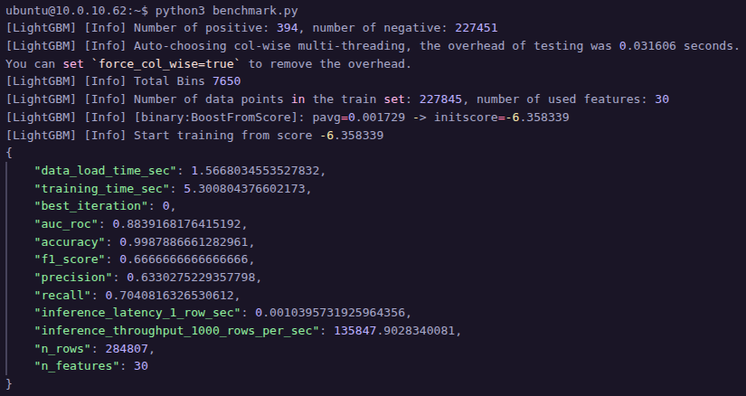
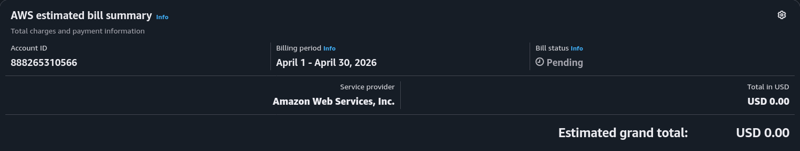

### Screenshot terminal

### Screenshot AWS Billing

### Báo cáo ngắn
- Mô hình LightGBM cho thời gian training khá nhanh, chỉ khoảng 5.3 giây với tập dữ liệu 284,807 dòng và 30 features, cho thấy khả năng xử lý tốt trên dữ liệu lớn.
- Chỉ số AUC đạt khoảng 0.884, nghĩa là model phân biệt khá ổn giữa hai lớp, nhưng chưa phải mức “gần hoàn hảo”.
- Accuracy đạt gần 99.9%, nhìn thì rất cao nhưng hơi “ảo” vì dataset bị mất cân bằng mạnh (positive chỉ có 394 mẫu).
- F1-score khoảng 0.667 cho thấy model vẫn bỏ sót hoặc dự đoán sai một phần transaction fraud.
- Recall ~0.704 nghĩa là phát hiện được khoảng 70% fraud, khá ổn nếu ưu tiên bắt gian lận.
- Precision ~0.633 cho thấy trong các giao dịch bị đánh dấu fraud thì khoảng 63% là đúng.
- Inference latency chỉ khoảng 0.001 giây cho 1 dòng dữ liệu, cực nhanh cho hệ thống realtime.
- Throughput đạt ~135k rows/giây, đủ mạnh để deploy cho pipeline xử lý giao dịch lớn hoặc streaming data.
- Phải sử dụng phương án CPU vì yêu cầu approve GPU vẫn ở trạng thái CASE_OPENED.
